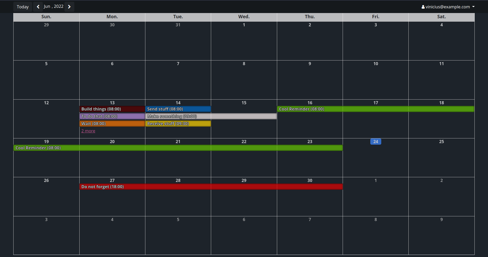
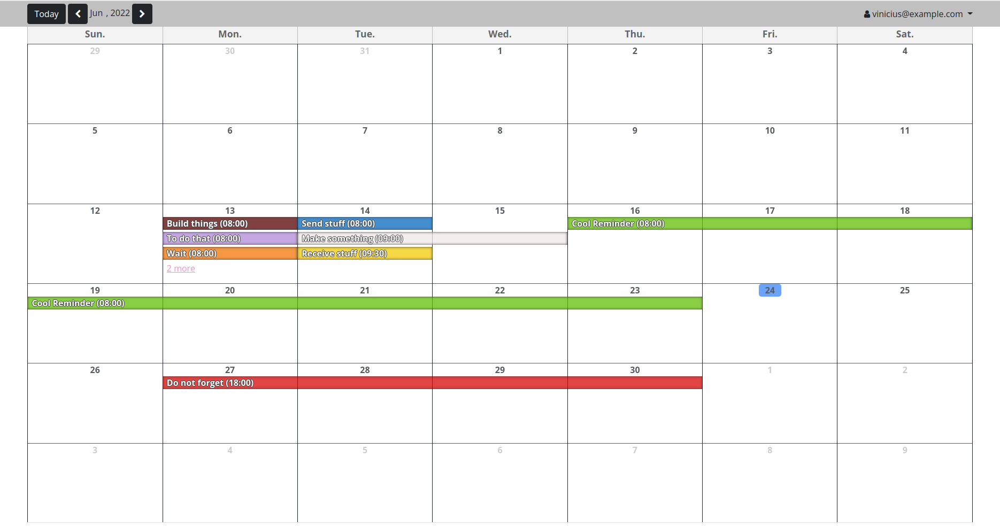
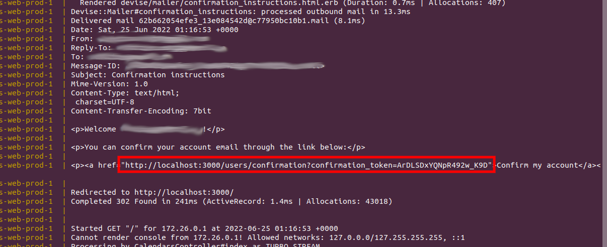
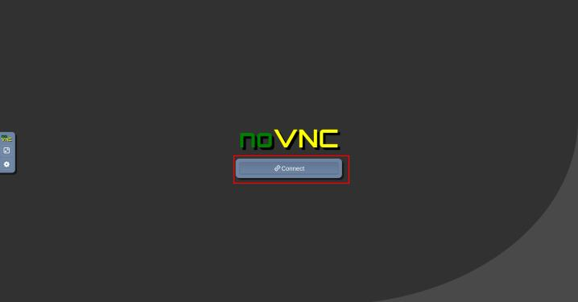

# ABOUT
Here are some important points about the projet:
* the project was made in Rails 7 with Bootstrap 5 to help in the frontend; 
* the user access control was implemented with Devise gem;
* the calendar are automatically updated with new reminders. For that, I used ActionCable;
* the project runs inside a Docker container;
* the calendar is available in this address: https://calendar-vgb.herokuapp.com/
* in production, the app sends an e-mail with a confirmation link. I used my e-mail address (vinicius.esufg@gmail.com) as the From header.
* the interface has a dark and a light theme, that is applied accordingly with the browser configuration:
## Dark:

## Light:

## How to run 

### Calendar App
To run the Calendar, you need to have *docker* and *docker compose plugin* installed in your machine. After cloning the repository, go to the project root directory and run the following command:

`docker compose --profile prod up`

You can access the calendar through the address: http://0.0.0.0:3000/.

There is a default user with the following credentials:
* E-mail: vinicius@example.com
* Password: 123456

If you want to create your own user, you should look the application log in the command line to get the confirmation link (as ilustrated in the following image). Just open this link in your browser and you will be able to sign in with your user.

### Tests
To run the tests, you can execute the following command:

`docker compose --profile test run --rm web-test bin/rails test`

### System Tests
Finally, to run the System Tests, you can execute the following command:

`docker compose --profile test run --rm web-test bin/rails test:system`

You can view the System Tests execution in your browser, through this link: http://localhost:7900/. 
First, click in Connect

Then, put `secret` in the Password field and click in **Send Credentials**.
